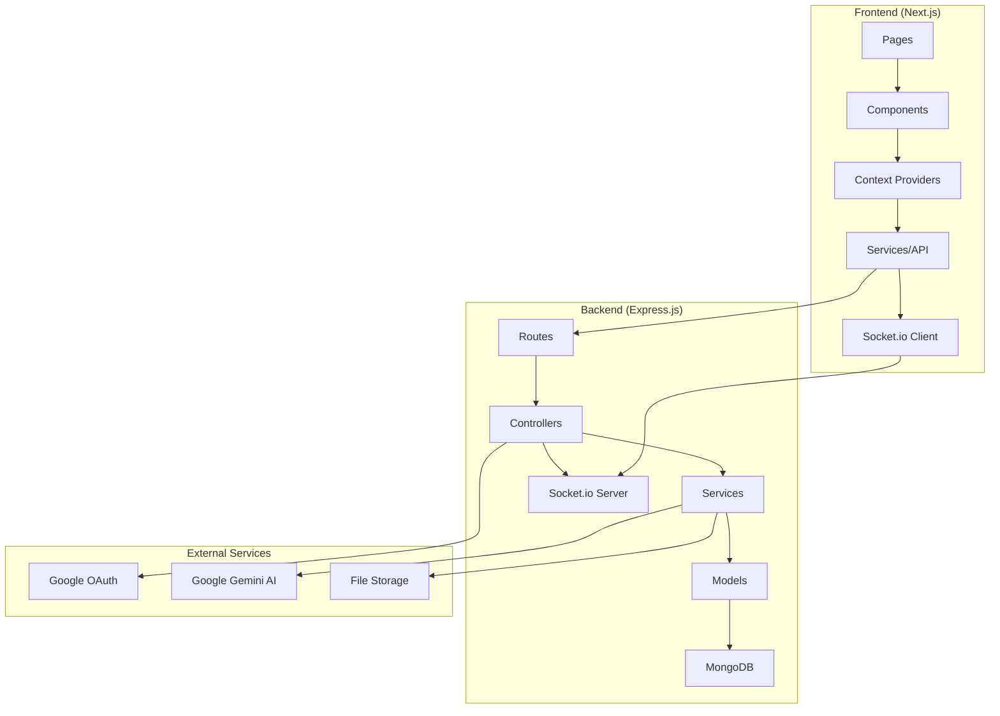

# Design Document

## Overview

This design document outlines the complete implementation of the Couple Chat App, a romantic messaging platform designed for couples to share conversations, memories, and strengthen their relationship bonds through AI-powered insights and analytics. The application follows a modern full-stack architecture with Next.js frontend and Express.js backend, emphasizing security, performance, and user experience.

## Architecture

### High-Level Architecture



### Technology Stack

- **Frontend**: Next.js 14 with TypeScript, Tailwind CSS, Framer Motion
- **Backend**: Node.js with Express.js, Socket.io for real-time communication
- **Database**: MongoDB with Mongoose ODM
- **Authentication**: JWT with Google OAuth integration
- **AI Integration**: Google Gemini 2.5 Flash API
- **File Processing**: Multer for uploads, csv-parser for CSV processing
- **Security**: Helmet, CORS, bcryptjs, rate limiting

## Components and Interfaces

### Frontend Components

#### Core Chat Components
- **ChatWindow**: Main chat interface with romantic UI theme
- **MessageBubble**: Individual message display with animations
- **MessageInput**: Input field with emoji support and send functionality
- **AIChatBot**: AI assistant panel with conversation suggestions
- **CsvUpload**: File upload component for importing chat history

#### Authentication Components
- **LoginForm**: Google OAuth and email/password login
- **SignupForm**: User registration with validation
- **AuthGuard**: Route protection wrapper

#### Analytics Components
- **AnalyticsDashboard**: Main analytics interface
- **ActivityChart**: Message frequency visualization
- **WordCloud**: Most used words display
- **RelationshipInsights**: AI-powered relationship analysis

#### UI Components
- **Button**: Reusable button with romantic styling
- **Card**: Container component with consistent styling
- **Tabs**: Navigation component for different sections
- **Modal**: Overlay component for dialogs

### Backend API Endpoints

#### Authentication Routes (`/api/auth`)
```typescript
POST /signup - User registration
POST /login - User login
POST /google-login - Google OAuth authentication
GET /profile - Get current user profile
PUT /profile - Update user profile
POST /logout - User logout
DELETE /account - Delete user account
```

#### Chat Routes (`/api/chat`)
```typescript
GET /chats - Get user's chats
POST /chats - Create new chat
GET /chats/:id - Get specific chat
POST /chats/:id/messages - Send message
GET /chats/:id/messages - Get chat messages
POST /chats/:id/upload-csv - Upload CSV chat history
```

#### Analytics Routes (`/api/analytics`)
```typescript
GET /chats/:id/analytics - Get chat analytics
GET /chats/:id/word-frequency - Get word frequency data
GET /chats/:id/activity - Get activity patterns
GET /chats/:id/milestones - Get relationship milestones
```

#### AI Routes (`/api/ai`)
```typescript
POST /chat-suggestions - Get conversation starters
POST /date-ideas - Get personalized date suggestions
POST /relationship-insights - Get AI relationship analysis
POST /ask-history - Ask questions about chat history
```

## Data Models

### User Model
```typescript
interface User {
  _id: ObjectId;
  name: string;
  email: string;
  password?: string; // Optional for OAuth users
  avatar?: string;
  googleId?: string;
  authProvider: 'local' | 'google';
  isEmailVerified: boolean;
  profile: {
    firstName?: string;
    lastName?: string;
    bio?: string;
    location?: string;
    dateOfBirth?: Date;
  };
  preferences: {
    language: string;
    notifications: {
      email: boolean;
      push: boolean;
    };
    privacy: {
      showOnlineStatus: boolean;
      allowAnalytics: boolean;
    };
  };
  coupleInfo: {
    relationshipStartDate?: Date;
    anniversaryDate?: Date;
    coupleTheme: 'classic' | 'modern' | 'playful' | 'romantic';
  };
  createdAt: Date;
  updatedAt: Date;
}
```

### Chat Model
```typescript
interface Chat {
  _id: ObjectId;
  participants: ObjectId[]; // Exactly 2 users
  chatName: string;
  isActive: boolean;
  lastMessageAt: Date;
  metadata: {
    anniversaryDate?: Date;
    relationshipStartDate?: Date;
    theme: 'classic' | 'modern' | 'playful' | 'romantic';
  };
  csvImports: Array<{
    fileName: string;
    importedAt: Date;
    messageCount: number;
    dateRange: {
      start: Date;
      end: Date;
    };
  }>;
  createdAt: Date;
  updatedAt: Date;
}
```

### Message Model
```typescript
interface Message {
  _id: ObjectId;
  chatId: ObjectId;
  sender: ObjectId;
  content: {
    text: string;
    type: 'text' | 'image' | 'file' | 'ai-generated';
    metadata?: {
      fileName?: string;
      fileSize?: number;
      mimeType?: string;
      isImported?: boolean;
      originalTimestamp?: Date;
    };
  };
  reactions: Array<{
    userId: ObjectId;
    emoji: string;
    createdAt: Date;
  }>;
  isEdited: boolean;
  editHistory?: Array<{
    content: string;
    editedAt: Date;
  }>;
  createdAt: Date;
  updatedAt: Date;
}
```

### Analytics Model
```typescript
interface ChatAnalytics {
  _id: ObjectId;
  chatId: ObjectId;
  dateRange: {
    start: Date;
    end: Date;
  };
  metrics: {
    totalMessages: number;
    messagesByUser: Record<string, number>;
    averageMessagesPerDay: number;
    longestConversation: {
      date: Date;
      messageCount: number;
    };
    mostActiveHour: number;
    mostActiveDay: string;
  };
  wordAnalysis: {
    totalWords: number;
    uniqueWords: number;
    mostUsedWords: Array<{
      word: string;
      count: number;
      userBreakdown: Record<string, number>;
    }>;
    sentiment: {
      positive: number;
      neutral: number;
      negative: number;
    };
  };
  aiInsights: {
    relationshipHealth: number; // 1-10 scale
    communicationPatterns: string[];
    suggestions: string[];
    milestones: Array<{
      date: Date;
      description: string;
      significance: 'low' | 'medium' | 'high';
    }>;
  };
  lastUpdated: Date;
}
```

## Error Handling

### Frontend Error Handling
- **Network Errors**: Retry mechanism with exponential backoff
- **Authentication Errors**: Automatic redirect to login page
- **Validation Errors**: Real-time form validation with user-friendly messages
- **File Upload Errors**: Progress indicators and error recovery options
- **AI Service Errors**: Graceful fallbacks with informative messages

### Backend Error Handling
- **Centralized Error Middleware**: Consistent error response format
- **Input Validation**: Express-validator for request validation
- **Database Errors**: Mongoose error handling with user-friendly messages
- **Rate Limiting**: Graceful handling of rate limit exceeded scenarios
- **File Processing Errors**: Detailed error messages for CSV import failures

### Error Response Format
```typescript
interface ErrorResponse {
  success: false;
  error: string;
  code?: string;
  details?: any;
  timestamp: string;
}
```

## Testing Strategy

### Frontend Testing
- **Unit Tests**: Jest and React Testing Library for components
- **Integration Tests**: Testing component interactions and API calls
- **E2E Tests**: Cypress for critical user workflows
- **Visual Regression Tests**: Storybook with Chromatic
- **Accessibility Tests**: axe-core integration

### Backend Testing
- **Unit Tests**: Jest for individual functions and utilities
- **Integration Tests**: Supertest for API endpoint testing
- **Database Tests**: MongoDB Memory Server for isolated testing
- **Load Tests**: Artillery for performance testing
- **Security Tests**: OWASP ZAP for vulnerability scanning

### Test Coverage Requirements
- **Minimum Coverage**: 80% for both frontend and backend
- **Critical Paths**: 95% coverage for authentication and message handling
- **Edge Cases**: Comprehensive testing for error scenarios

## Security Implementation

### Authentication & Authorization
- **JWT Tokens**: Secure token generation with proper expiration
- **Google OAuth**: Secure integration with proper scope validation
- **Session Management**: Secure cookie handling with httpOnly flags
- **Password Security**: bcrypt hashing with salt rounds

### Data Protection
- **Encryption at Rest**: MongoDB encryption for sensitive data
- **Encryption in Transit**: HTTPS/TLS for all communications
- **Input Sanitization**: XSS and injection attack prevention
- **CORS Configuration**: Strict origin validation

### Privacy Features
- **Data Deletion**: Complete user data removal on account deletion
- **AI Privacy**: No permanent storage of personal data with third parties
- **Audit Logging**: Security event logging for monitoring
- **Rate Limiting**: Protection against abuse and DoS attacks

## Performance Optimization

### Frontend Performance
- **Code Splitting**: Dynamic imports for route-based splitting
- **Image Optimization**: Next.js Image component with lazy loading
- **Caching**: Service worker for offline functionality
- **Bundle Optimization**: Tree shaking and minification

### Backend Performance
- **Database Indexing**: Optimized queries with proper indexes
- **Caching**: Redis for session and frequently accessed data
- **Connection Pooling**: MongoDB connection optimization
- **Response Compression**: Gzip compression for API responses

### Real-time Performance
- **Socket.io Optimization**: Room-based message broadcasting
- **Message Queuing**: Offline message handling and delivery
- **Connection Management**: Automatic reconnection with backoff
- **Typing Indicators**: Debounced typing status updates

## Internationalization & Accessibility

### Multi-language Support
- **Tanglish Processing**: Tamil-English mixed text handling
- **Unicode Support**: Proper rendering of Tamil characters
- **Language Detection**: Automatic language identification
- **Font Loading**: Optimized font loading for multiple scripts

### Accessibility Features
- **WCAG 2.1 Compliance**: AA level accessibility standards
- **Keyboard Navigation**: Full keyboard accessibility
- **Screen Reader Support**: Proper ARIA labels and descriptions
- **Color Contrast**: High contrast ratios for readability
- **Focus Management**: Proper focus handling in modals and forms

## Deployment Architecture

### Production Environment
- **Frontend**: Vercel deployment with CDN
- **Backend**: Railway/Heroku with auto-scaling
- **Database**: MongoDB Atlas with replica sets
- **File Storage**: AWS S3 or similar cloud storage
- **Monitoring**: Application performance monitoring

### Development Environment
- **Local Development**: Docker Compose for consistent environment
- **CI/CD Pipeline**: GitHub Actions for automated testing and deployment
- **Environment Management**: Separate configs for dev/staging/production
- **Database Seeding**: Automated test data generation

## Monitoring and Analytics

### Application Monitoring
- **Error Tracking**: Sentry for error monitoring and alerting
- **Performance Monitoring**: Application performance metrics
- **Uptime Monitoring**: Service availability tracking
- **User Analytics**: Privacy-compliant usage analytics

### Business Metrics
- **User Engagement**: Message frequency and session duration
- **Feature Usage**: Analytics dashboard and AI feature adoption
- **Relationship Health**: Aggregate relationship health trends
- **System Health**: Database performance and API response times